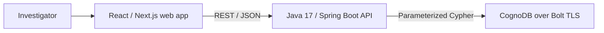
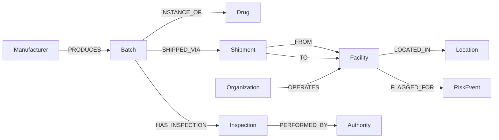

# PharmRoute.Ai

PharmRoute.Ai is an explainable pharmaceutical supply-chain investigation application backed by CognoDB. It helps a non-technical investigator trace a medicine batch, inspect every hand-off, and discover other batches indirectly exposed to a risky facility or counterfeit incident.

This repository is being built for the Wexa AI graph database take-home assessment.

## Live demo

- **Application:** https://pharmatrace-web.onrender.com
- **API health:** https://pharmatrace-api-vev3.onrender.com/actuator/health
- **Source:** https://github.com/dm212/PharmRoute.Ai

The frontend and API run as separate Render services on the free tier and can take up to a minute to wake after inactivity. The application is public and requires no sign-in.
Render retains the services' original hostnames after a service rename; the product and repository are branded as PharmRoute.Ai.

## Current scope

The assessment version deliberately focuses on three complete workflows:

1. **Batch lookup** - find a medicine batch and view its provenance and risk summary.
2. **Supply-chain trace** - follow the batch from manufacturer through facilities and shipments to its destination.
3. **Risk investigation** - discover related batches exposed through shared facilities, organizations, or incidents and show the evidence path.

## Why a graph database?

Pharmaceutical supply chains form networks rather than simple linear pipelines. A medicine batch can pass through several facilities, shipments, organizations, and inspections, while each facility handles many other batches. Investigating counterfeit exposure therefore requires following connections across several levels and explaining the exact path that created a risk.

A relational implementation would spread this information across many tables and rely on repeated joins or recursive queries to trace variable-length routes and discover indirectly exposed batches. In CognoDB, batches, drugs, organizations, facilities, shipments, inspections, and incidents are represented as nodes connected by explicit relationships. Cypher can traverse those paths naturally and return the evidence behind each result.

## Architecture



The backend is a modular Spring Boot application rather than multiple microservices. This keeps the take-home maintainable and deployable while preserving clear controller, service, and repository boundaries.

## Graph model



The deterministic seed dataset includes eight medicine batches and multiple shipment, inspection, cold-chain, tampering, and suspected-counterfeit relationship paths.

## Repository layout

```text
.
├── app/                 # React / Next.js frontend
├── backend/             # Java 17 / Spring Boot REST API
├── docs/                # Architecture, screenshots, and recording notes
├── scripts/             # CognoDB constraints and seed data
├── public/              # Frontend static assets
└── .github/workflows/   # Automated checks
```

## Local prerequisites

- Node.js 22+
- Java 17+
- A CognoDB Cloud c0 instance

## Local development

Create `backend/cognodb.env` from `backend/.env.example` and provide the CognoDB URI and password. Keep seed loading disabled after the first successful load.

Start the backend:

```bash
cd backend
./mvnw spring-boot:run
```

Start the frontend in a second terminal:

```bash
npm install
npm run dev
```

Open `http://localhost:3000` and investigate the seeded batch `BT-2026-0812-A17`.

## Quality checks

Run the complete frontend gate:

```bash
npm run check
```

Run backend tests and create the executable application package:

```bash
cd backend
./mvnw verify
```

GitHub Actions runs both gates for every pull request and every push to `main`. The backend also includes a multi-stage, non-root Docker image definition for deployment.

## Security

CognoDB connection details are read from environment variables. Real credentials must never be committed. Copy the relevant `.env.example` file locally and provide values only in your development or hosting environment.

## Production deployment

The Spring Boot API includes a Dockerfile and a Render Blueprint (`render.yaml`). Create a Render Blueprint from this repository, then provide `COGNODB_URI`, `COGNODB_PASSWORD`, and the deployed frontend origin as `APP_CORS_ALLOWED_ORIGINS`. The health check is available at `/actuator/health`.

The web application is built and deployed as a Node service on Render. Its production API origin is supplied with `NEXT_PUBLIC_API_BASE_URL`; no CognoDB credentials are sent to the browser.

## Demo walkthrough

Use batch `BT-2026-0812-A17` for the primary demonstration:

1. Search for the batch and review its risk status.
2. Follow its three-leg journey through the supply chain.
3. Inspect its recorded inspection and two graph-derived risk exposures.
4. Explain how shared facilities and incidents connect this batch to related batches.

Additional presentation scenarios:

- `BT-2026-0814-I31` — quarantined Insulivex batch with a failed inspection and cold-chain breach.
- `BT-2026-0813-I08` — delivered Insulivex batch indirectly exposed through the same cold-storage facility.
- `BT-2026-0815-C77` — recalled Cardiovex batch linked to a suspected-counterfeit wholesaler.
- `BT-2026-0814-N45` — NeuroCalm batch placed on hold through the same counterfeit-risk connection.

## Delivery phases

- [x] Define the use case and architecture
- [x] Implement graph constraints, seed data, and core Cypher queries
- [x] Implement the Spring Boot API and error handling
- [x] Implement the investigation UI and UX states
- [x] Add tests, CI, and production configuration
- [x] Deploy, document, and capture production screenshots
- [ ] Record the walkthrough using `docs/RECORDING_GUIDE.md`
- [ ] Run the final assessment compliance audit
